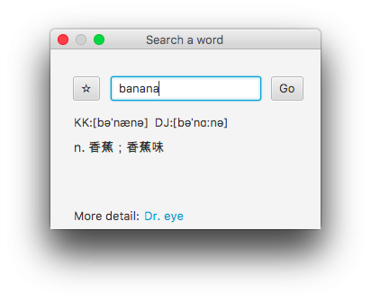

# Vocabulary Tool

This application will pin the top on the screen and show an English word and Chinese explanation correspondingly.

## Release note
### 0.3.0.170627
Add search window to provide the function for lookup the vocabulary.

### 0.2.0.170619
Save favorite vocabulary.

### 0.1.0.170604
First version. Provide the simplest word card.

1. Embedded dictionary.
2. Constant time (5 minutes) to switch the English word.

## Reference
* Dictionary source: [https://github.com/schrbjvc0127/EnglishGame](https://github.com/schrbjvc0127/EnglishGame)
* Phonetic source: [Dy.eye](http://yun.dreye.com/)